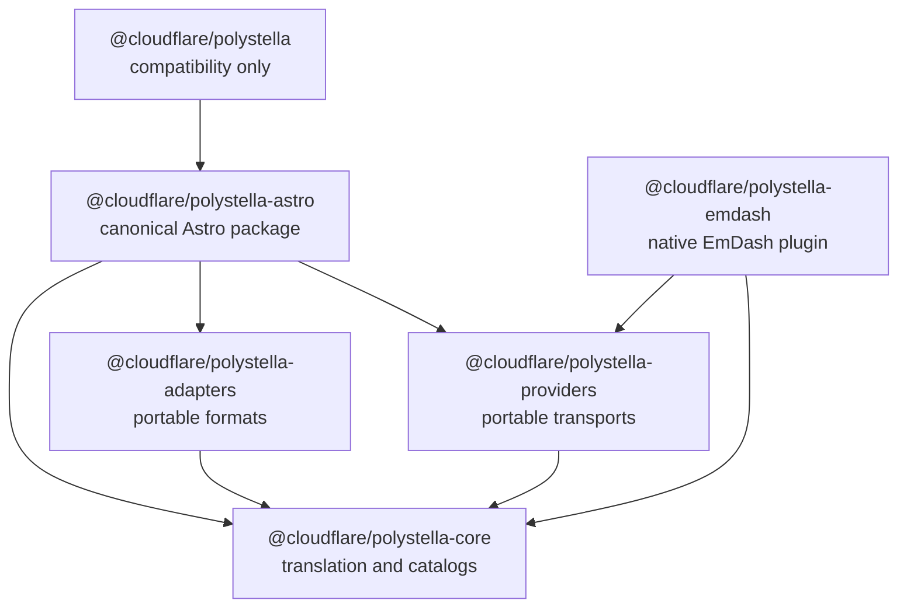
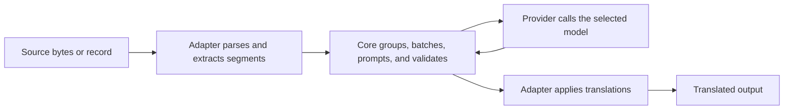
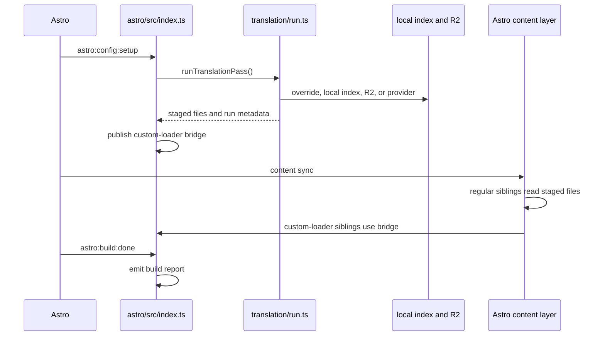

# PolyStella Package Architecture

This guide explains the repository structure after the package migration. It
is the starting point for deciding where a change belongs. For detailed
pipeline behavior and hard correctness contracts, use
[`ARCHITECTURE.md`](./ARCHITECTURE.md).

## Package Graph

PolyStella publishes six packages. The canonical Astro package and its
compatibility package form one fixed version group. Core, adapters, providers,
and EmDash are versioned independently. Arrows mean "depends on."

Dependencies point toward reusable code. Core never imports adapters,
providers, Astro, or EmDash. Adapters and providers do not import each other. The
compatibility package contains no implementation and points only to the
canonical Astro package.

Published dependencies on independently versioned packages use compatible
caret ranges. The compatibility package pins the exact Astro version because
it forwards that package's API and CLI unchanged.

| Directory                                        | Published package                  | Responsibility                                                                         |
| :----------------------------------------------- | :--------------------------------- | :------------------------------------------------------------------------------------- |
| [`packages/core/`](./packages/core/)             | `@cloudflare/polystella-core`      | Translation contracts, catalogs, prompts, batching, retries, and response parsing.     |
| [`packages/adapters/`](./packages/adapters/)     | `@cloudflare/polystella-adapters`  | Portable parsing, extraction, grouping, and translation application.                   |
| [`packages/providers/`](./packages/providers/)   | `@cloudflare/polystella-providers` | Workers AI and Anthropic implementations of the core translator contract.              |
| [`packages/emdash/`](./packages/emdash/)         | `@cloudflare/polystella-emdash`    | Native EmDash content translation, deployment policy, admin UI, and catalog overrides. |
| [`packages/astro/`](./packages/astro/)           | `@cloudflare/polystella-astro`     | Canonical Astro integration, host policy, storage, routing, runtime APIs, and CLI.     |
| [`packages/polystella/`](./packages/polystella/) | `@cloudflare/polystella`           | Temporary compatibility forwarding to `@cloudflare/polystella-astro`.                  |

## Direct Translation Flow

The three reusable packages form an in-process translation pipeline:

The adapter owns source syntax. Core owns the translation protocol. The
provider owns transport-specific I/O. None of these layers needs Astro.

## Package Responsibilities

### Core

[`@cloudflare/polystella-core`](./packages/core/) is the lowest internal layer.
It owns:

- `Segment`, `Glossary`, `Logger`, and `Translator` contracts.
- Prompt construction and provider-response parsing.
- Token estimation, grouping validation, and batch packing.
- Translation execution, retries, cancellation, and permanent provider errors.
- Dependency-free catalog lookup, fallback, and interpolation.
- Catalog AI translation and `{{token}}` validation.

Start at [`packages/core/src/index.ts`](./packages/core/src/index.ts). The main
implementations are `translator.ts`, `prompt.ts`, `batch.ts`,
`translate-batch.ts`, `translate-segments.ts`, and
[`catalog/`](./packages/core/src/catalog/).

Core does not know about file formats, R2, the filesystem, Astro, or any
specific AI transport.

### Adapters

[`@cloudflare/polystella-adapters`](./packages/adapters/) owns portable format
handling:

- The [`FileAdapter`](./packages/adapters/src/adapter.ts) contract.
- Markdown, MDX, JSON, YAML, and TOML adapters.
- Segment extraction, grouping, and translation application.
- Structured key paths, MDX rules, and placeholder handling.

Start at [`packages/adapters/src/index.ts`](./packages/adapters/src/index.ts)
and [`packages/adapters/src/adapters/`](./packages/adapters/src/adapters/).
Adapters depend on core for `Segment` and related contracts.

Astro-specific defaults, configuration, staging, and URL policy do not belong
here. Those wrappers live under
[`packages/astro/src/parsing/`](./packages/astro/src/parsing/).

### Providers

[`@cloudflare/polystella-providers`](./packages/providers/) implements the
core `Translator` contract for external model APIs:

- Workers AI over HTTP.
- Workers AI through a binding described with package-owned structural types.
- Anthropic over HTTP.
- Transport error normalization and permanent/retriable classification.

Start at [`packages/providers/src/index.ts`](./packages/providers/src/index.ts),
`workers-ai.ts`, `anthropic.ts`, and `http-error.ts`. Providers depend only on
core internally.

Provider configuration belongs to the Astro package. The mapping from Astro
options to provider factories is
[`packages/astro/src/translation/provider.ts`](./packages/astro/src/translation/provider.ts).

### EmDash

[`@cloudflare/polystella-emdash`](./packages/emdash/) owns EmDash-specific
deployment validation, plugin declarations, storage policy, routes, and native
admin UI. Git-owned catalog lookup and translation remain in core.

Start at [`packages/emdash/src/index.ts`](./packages/emdash/src/index.ts). The
route boundary lives in [`packages/emdash/src/routes.ts`](./packages/emdash/src/routes.ts),
the native UI in [`packages/emdash/src/admin.tsx`](./packages/emdash/src/admin.tsx),
and the catalog override model in
[`packages/emdash/src/catalog.ts`](./packages/emdash/src/catalog.ts). EmDash
depends on providers for the Workers AI binding translator.

### Astro

[`@cloudflare/polystella-astro`](./packages/astro/) is the canonical product
package. It composes the reusable packages and owns host-specific behavior:

- Astro hooks, option validation, and virtual modules.
- Source walking, translation-pass orchestration, and local staging.
- R2 keys, reads, writes, metadata, local indexes, reports, and pruning.
- Overrides, AI markers, and URL rewriting policy.
- Content collections, custom-loader support, runtime lookup, and middleware.
- Route shims, UI-string filesystem policy, catalog-only Astro mode, React
  hooks, recipes, and CLI.

The primary entry points are:

| Area                | Start here                                                                         |
| :------------------ | :--------------------------------------------------------------------------------- |
| Integration hooks   | [`packages/astro/src/index.ts`](./packages/astro/src/index.ts)                     |
| Configuration       | [`packages/astro/src/config/options.ts`](./packages/astro/src/config/options.ts)   |
| Translation pass    | [`packages/astro/src/translation/run.ts`](./packages/astro/src/translation/run.ts) |
| Storage and cache   | [`packages/astro/src/storage/`](./packages/astro/src/storage/)                     |
| Format policy       | [`packages/astro/src/parsing/`](./packages/astro/src/parsing/)                     |
| Content collections | [`packages/astro/src/content/`](./packages/astro/src/content/)                     |
| Runtime APIs        | [`packages/astro/src/runtime/`](./packages/astro/src/runtime/)                     |
| Routing             | [`packages/astro/src/routing/`](./packages/astro/src/routing/)                     |
| UI strings          | [`packages/astro/src/i18n/`](./packages/astro/src/i18n/)                           |
| Catalog-only mode   | [`packages/astro/src/catalog/`](./packages/astro/src/catalog/)                     |
| CLI dispatch        | [`packages/astro/src/cli.ts`](./packages/astro/src/cli.ts)                         |

Its public export map is declared in
[`packages/astro/package.json`](./packages/astro/package.json). The standalone
`polystella` executable is emitted from `src/cli.ts`. The `./client` export is
types-only and comes from [`packages/astro/client.d.ts`](./packages/astro/client.d.ts).

### Compatibility Package

[`@cloudflare/polystella`](./packages/polystella/) is not an implementation
layer. It exists so projects using the old package name can migrate without an
immediate import rewrite.

- Every source entry re-exports the matching `@cloudflare/polystella-astro`
  entry.
- `client.d.ts` references the canonical client declarations.
- Its CLI launches the canonical package's CLI.
- It must not gain independent behavior or restore low-level exports moved to
  core, adapters, or providers.

When adding an Astro public export, update the canonical manifest, add the
matching forwarding file and export in `packages/polystella/`, update the
public export reference, and run `pnpm check:packages`.

## Astro Build Flow

The integration and standalone CLI share
[`runTranslationPass`](./packages/astro/src/translation/run.ts). Astro-specific
setup remains in the integration entry.

Translation must run during `astro:config:setup` because Astro syncs content
before `build:start`. See [`ARCHITECTURE.md#hook-timing`](./ARCHITECTURE.md#hook-timing).

## Where Changes Belong

| Change                                                                | Package               |
| :-------------------------------------------------------------------- | :-------------------- |
| Change prompts, batching, retry behavior, or translator contracts     | Core                  |
| Parse or reconstruct a portable content format                        | Adapters              |
| Add or change an external AI transport                                | Providers             |
| Change Astro options, files, R2, routing, middleware, content, or CLI | Astro                 |
| Change EmDash options, storage, routes, or native admin UI            | EmDash                |
| Mirror a canonical Astro export under the old package name            | Compatibility package |

If a change requires Node, Astro, filesystem, or R2 APIs, it does not belong in
core, adapters, or providers. If a provider implementation starts importing
Astro config types, move that mapping back to the Astro package instead.

## Boundary Enforcement

The boundaries are executable, not only documented:

| Contract                                                                            | Enforcement                                                                                                                 |
| :---------------------------------------------------------------------------------- | :-------------------------------------------------------------------------------------------------------------------------- |
| Package dependency graph, exports, tarball contents, CLIs, and compatibility parity | [`scripts/check-packages.mjs`](./scripts/check-packages.mjs)                                                                |
| Reusable packages avoid Node and host imports                                       | [`tests/boundaries/reusable-packages.test.ts`](./tests/boundaries/reusable-packages.test.ts)                                |
| Reusable packages execute under Workerd without `nodejs_compat`                     | [`tests/workerd/`](./tests/workerd/) and [`scripts/check-workerd-portability.mjs`](./scripts/check-workerd-portability.mjs) |
| End-to-end extraction behavior remains stable                                       | [`scripts/check-monorepo-baseline.mjs`](./scripts/check-monorepo-baseline.mjs)                                              |
| Public export documentation matches manifests                                       | [`docs/scripts/check-exports.ts`](./docs/scripts/check-exports.ts)                                                          |
| All packages version together                                                       | [`.changeset/config.json`](./.changeset/config.json)                                                                        |

The root [`package.json`](./package.json) builds in dependency order: core,
adapters, providers, canonical Astro, then compatibility forwarding.

## Contributor Checklist

Before opening a package-affecting change:

1. Put the change in the lowest package that can own it without importing a
   higher layer.
2. Export it only if downstream consumers need it; package manifests are the
   public API source of truth.
3. Mirror new Astro exports in the compatibility package while that package is
   supported.
4. Add or update the smallest boundary or behavior test that protects the
   contract.
5. Add a Changesets entry and run `pnpm test`, `pnpm typecheck`, and
   `pnpm check:packages`.

## Deeper Design References

Use these stable sections for implementation details:

- [Package boundaries](./ARCHITECTURE.md#package-boundaries)
- [Pipeline](./ARCHITECTURE.md#pipeline)
- [Invariants](./ARCHITECTURE.md#invariants)
- [Adapter contract](./ARCHITECTURE.md#adapter-contract)
- [Translator contract](./ARCHITECTURE.md#translator-contract)
- [Translation batching](./ARCHITECTURE.md#translation-batching)
- [Cache key](./ARCHITECTURE.md#cache-key)
- [Cache write order](./ARCHITECTURE.md#cache-write-order)
- [Runtime bridge](./ARCHITECTURE.md#runtime-bridge)
- [Routing shims](./ARCHITECTURE.md#routing-shims)
- [UI strings](./ARCHITECTURE.md#ui-strings)
